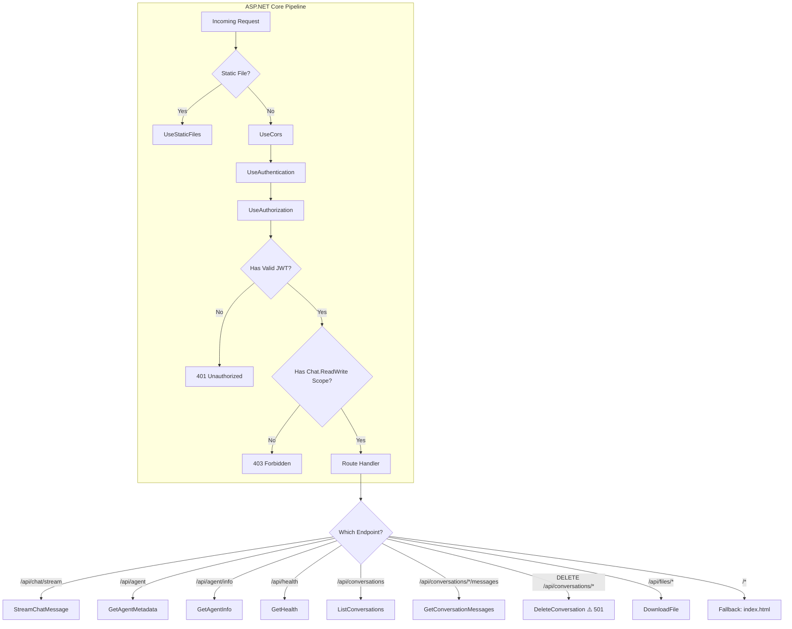
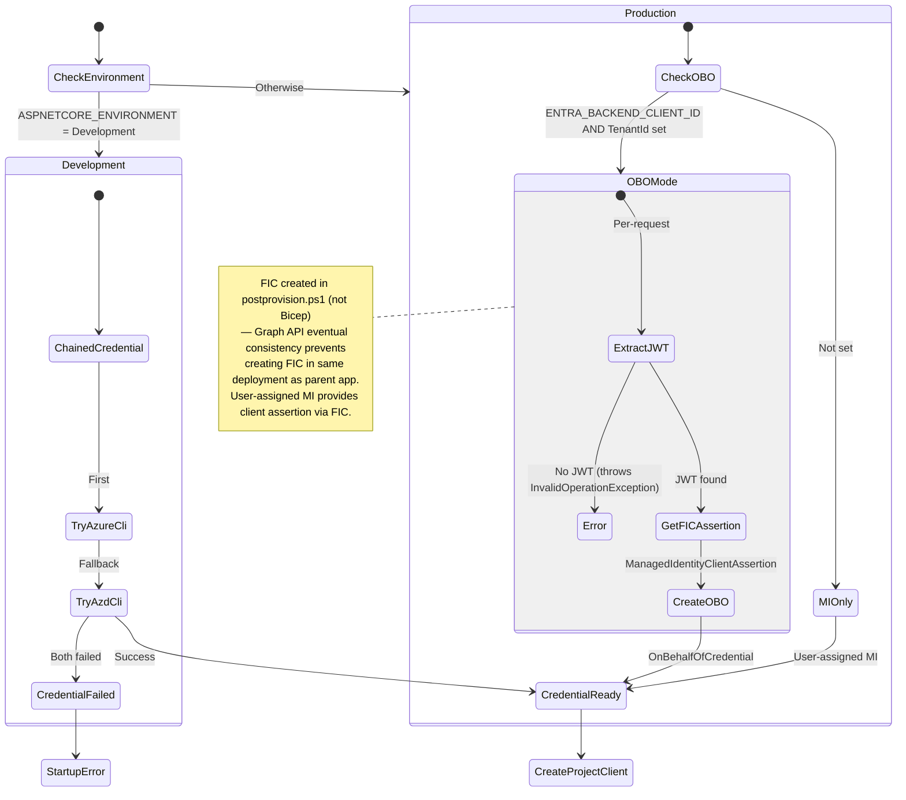
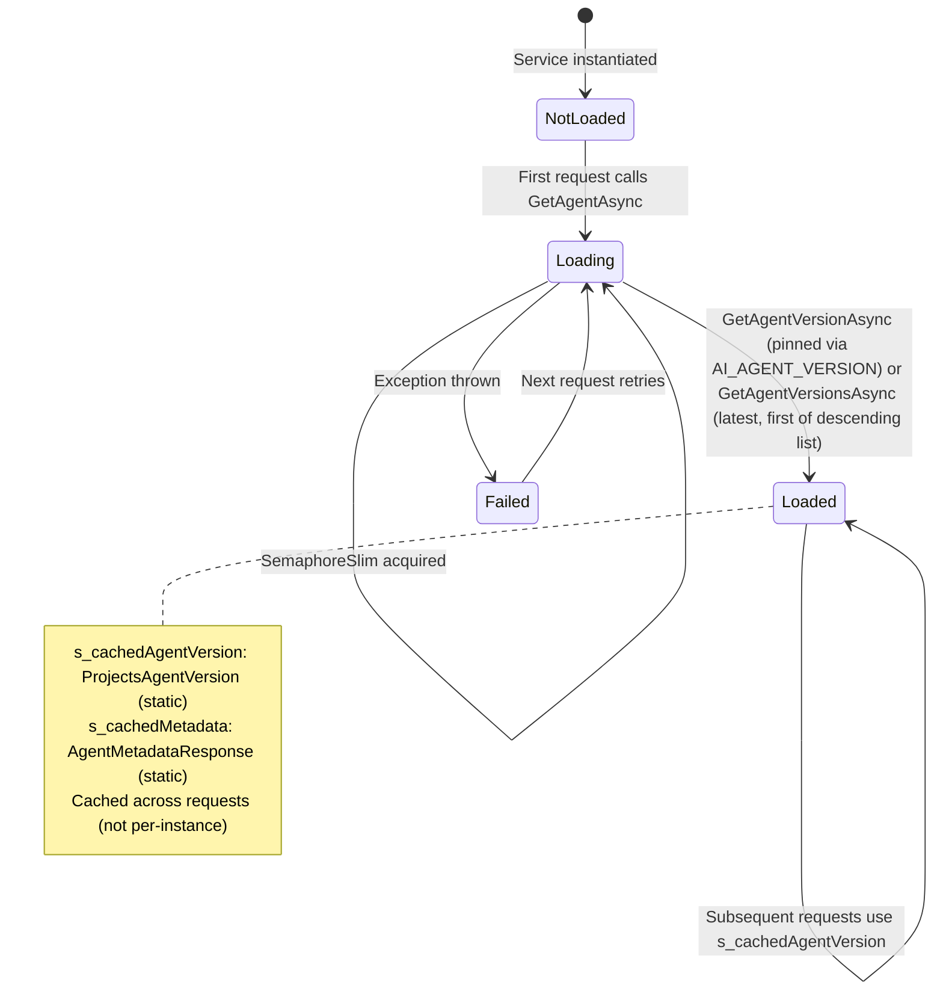
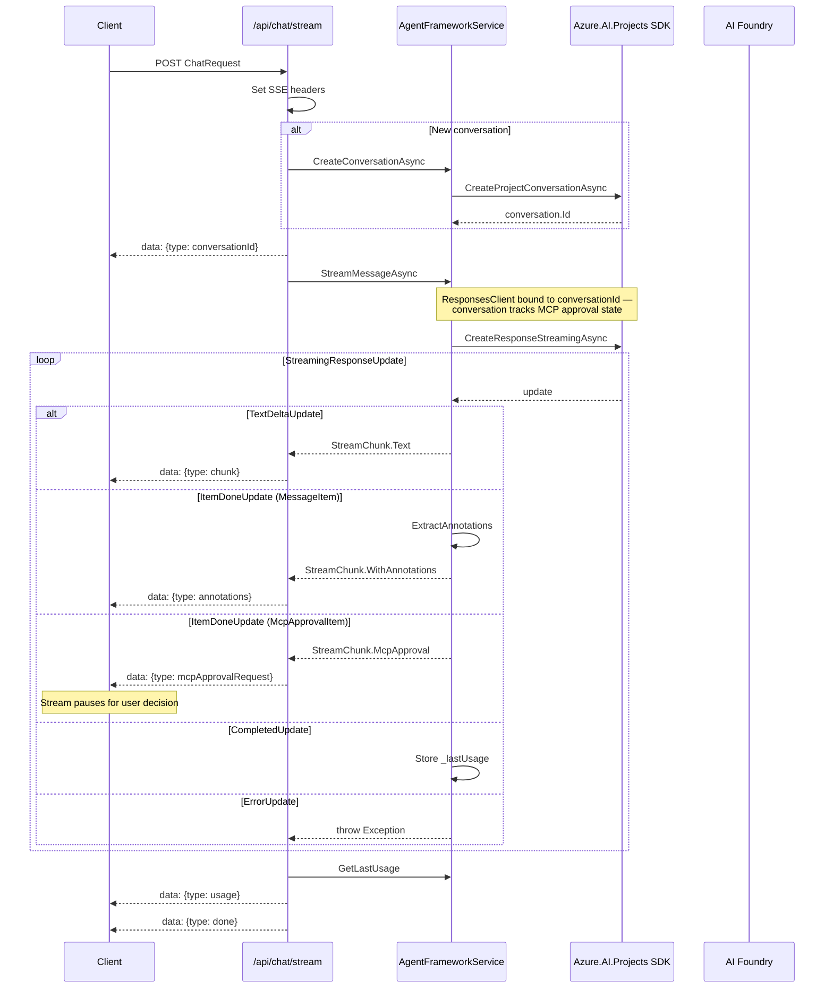
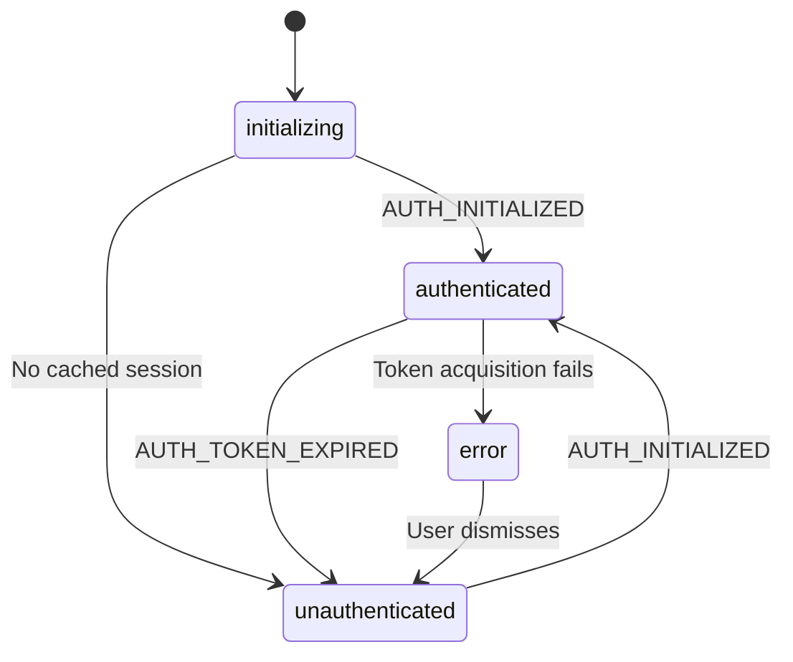
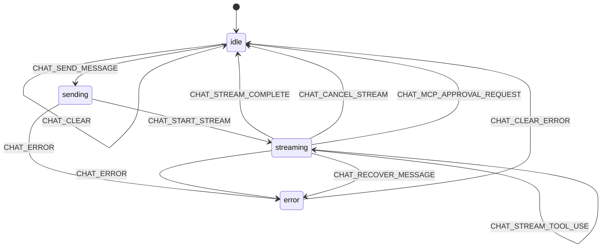
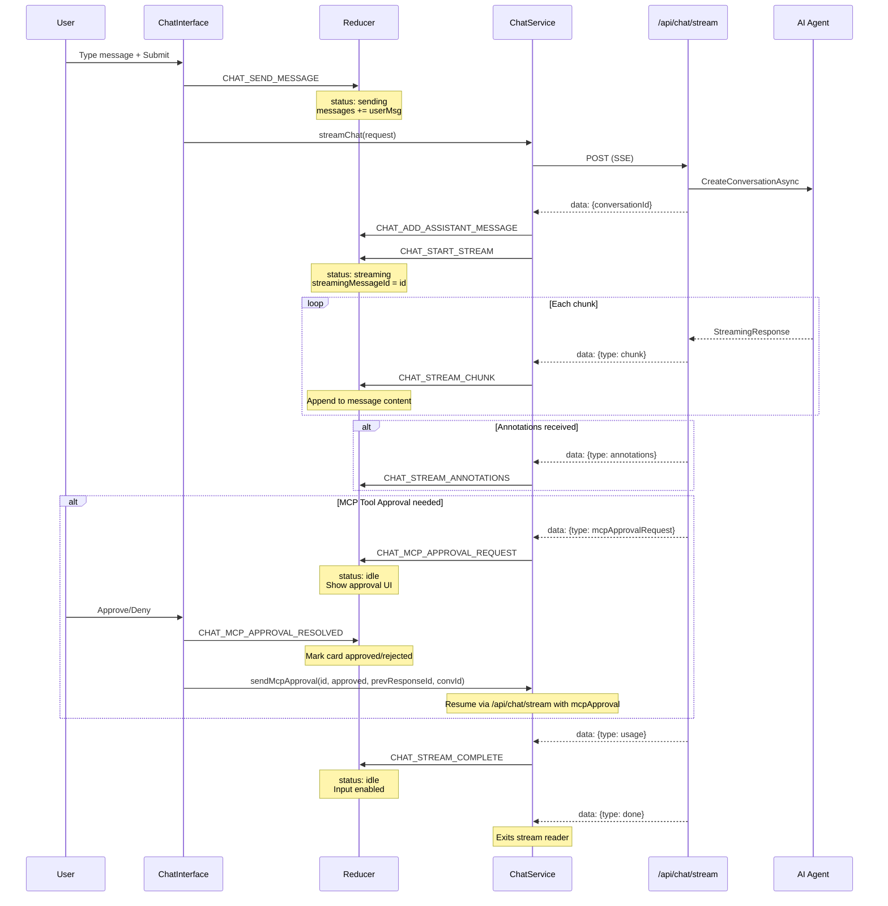
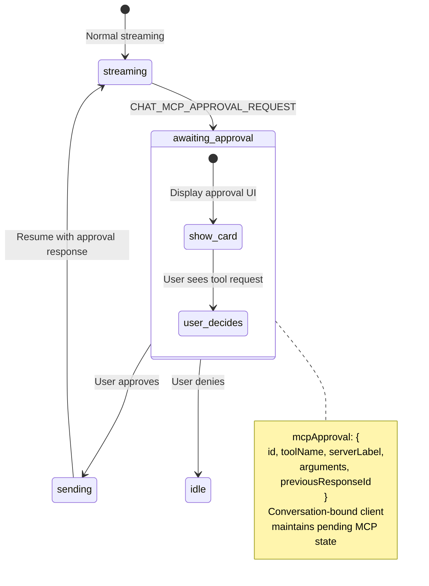
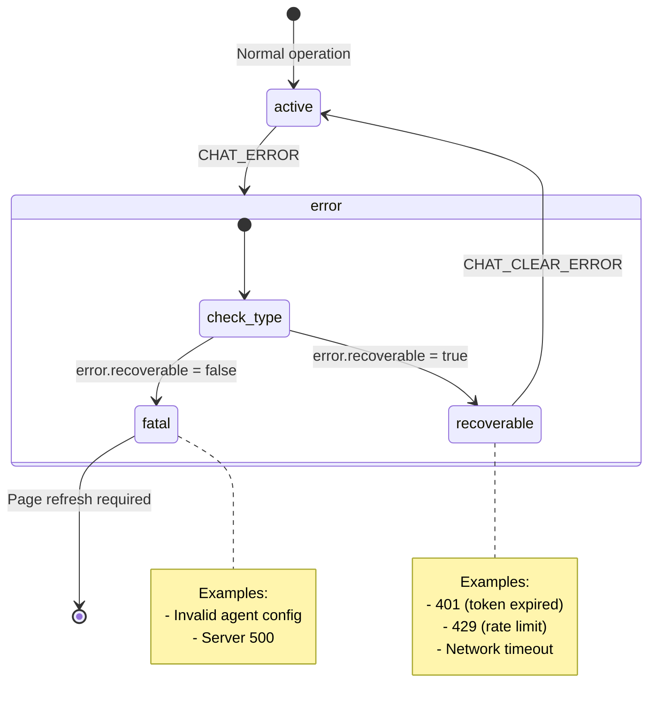
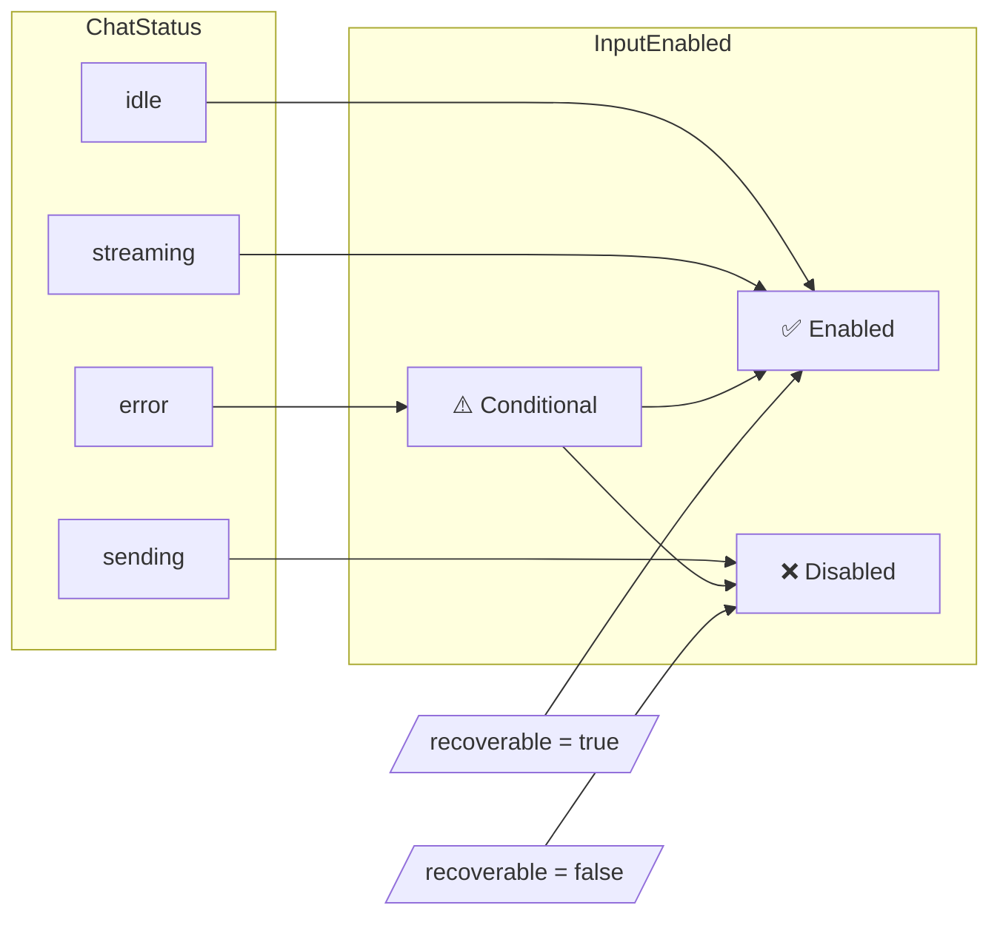

# Architecture Flow

State transitions and data flow diagrams for the foundry-agent-webapp application.

## Overview

The app has two distinct state domains:

| Domain | Location | Pattern |
|--------|----------|---------|
| **Frontend** | React (AppContext) | useReducer with discriminated actions |
| **Backend** | ASP.NET Core | Stateless request handling + lazy-cached agent |

---

## Part 1: Backend Flow

### 1.1 Request Pipeline



### 1.2 Credential Resolution



### 1.3 Agent Loading (Lazy Singleton)



### 1.4 SSE Streaming Pipeline



### 1.5 Backend SSE Event Types

| Event Type | When Sent | Payload |
|------------|-----------|---------|
| `conversationId` | First, always | `{conversationId: string}` |
| `chunk` | Per text delta | `{content: string}` |
| `annotations` | After item complete | `{annotations: AnnotationInfo[]}` — each annotation may include `containerId` for container file citations |
| `mcpApprovalRequest` | MCP tool needs approval | `{approvalRequest: {...}}` |
| `toolUse` | When agent starts using a tool | `{toolName: string}` |
| `usage` | Before done | `{duration, promptTokens, completionTokens, totalTokens}` |
| `done` | Last, always | `{}` |
| `error` | On exception | `{message: string}` |

---

## Part 2: Frontend State

The frontend manages three state domains:
- **Auth State**: User authentication lifecycle
- **Chat State**: Message and streaming lifecycle  
- **UI State**: Input enablement (derived from chat state)

### 2.1 Authentication State Machine



### Auth States

| State | Description | User Object |
|-------|-------------|-------------|
| `initializing` | App startup, checking MSAL cache | `null` |
| `authenticated` | Valid session, user info available | `AccountInfo` |
| `unauthenticated` | No session, login required | `null` |
| `error` | Auth failure (rare) | `null` |

---

### 2.2 Chat State Machine



### Chat States

| State | Description | Input Enabled | streamingMessageId |
|-------|-------------|---------------|-------------------|
| `idle` | Ready for input | ✅ Yes (except during MCP approval) | `undefined` |
| `sending` | Request in flight | ❌ No | `undefined` |
| `streaming` | Receiving chunks (or retrying) | ✅ Yes (messages queue) | Message ID |
| `error` | Failure occurred | If recoverable | `undefined` |

### Message Queue

When the AI is streaming, the input stays enabled. Messages sent during streaming are queued in `pendingMessages[]` (with optional file attachments) and shown as dismissible chips below the input. When the stream completes and status returns to `idle`, queued messages are combined (newline-separated) into a single message and auto-sent. Files from all queued messages are merged.

### Message Actions

Assistant messages display a hover action bar with Copy, Regenerate, and Feedback (👍👎) buttons. User messages show an Edit button on the last message.
- **Regenerate**: Removes the last assistant response and auto-resends the user's message
- **Edit**: Removes the target message and everything after it, then auto-resends with the edited text
- **Feedback**: Tracks 👍👎 ratings to Application Insights via `trackEvent`

### Tool-Use Visualization

When the AI agent uses tools (file search, code interpreter, function calls), the backend streams `toolUse` SSE events. The UI shows an inline indicator (e.g., "Searching files...") on the assistant message during tool execution.

### Input Enhancements

- **Voice Input**: Web Speech API microphone button with feature detection
- **Drag-and-Drop**: File drop zone overlay on the chat area
- **Keyboard Shortcuts**: ⌨️ toolbar button opens shortcuts dialog; `Ctrl+N` for new chat
- **Toolbar Layout**: Primary actions (attach, cancel, voice, new chat) are always visible; secondary actions (history, export, shortcuts, settings) are in a ⋯ overflow menu to keep the UI clean

### Conversation Management

- **Search**: Client-side filtering in the conversation sidebar
- **Export**: Download conversation as Markdown
- **Smart Scroll**: Auto-scroll only when near bottom; "↓ New messages" pill when scrolled up

### Stream Retry & Message Recovery

When a stream fails, the system automatically retries up to 3 times with exponential backoff. During retries, the assistant message shows a "Retrying (2/3)..." indicator via the `CHAT_STREAM_RETRY` action.

If all retries are exhausted, `CHAT_RECOVER_MESSAGE` removes the failed user message and assistant placeholder from the chat, restores the original message text to the input via `recoveredInput`, and shows an error banner. The user can simply press Send again.

---

### 2.3 End-to-End Message Flow



---

### 2.4 MCP Tool Approval Flow



---

### 2.5 Error Recovery Flow



---

### 2.6 UI State Derivation

The UI state (`chatInputEnabled`) is derived from chat state:



---

### 2.7 Action Reference

| Action | From State(s) | To State | Side Effects |
|--------|--------------|----------|--------------|
| `AUTH_INITIALIZED` | initializing, unauthenticated | authenticated | Set user object |
| `AUTH_TOKEN_EXPIRED` | authenticated | unauthenticated | Clear user |
| `CHAT_SEND_MESSAGE` | idle | sending | Append user message |
| `CHAT_ADD_ASSISTANT_MESSAGE` | sending | sending | Create empty assistant msg |
| `CHAT_START_STREAM` | sending | streaming | Set conversationId, messageId |
| `CHAT_STREAM_CHUNK` | streaming | streaming | Append content to msg |
| `CHAT_STREAM_ANNOTATIONS` | streaming | streaming | Add citations to msg |
| `CHAT_MCP_APPROVAL_REQUEST` | streaming | idle | Add approval message, keep input disabled |
| `CHAT_MCP_APPROVAL_RESOLVED` | idle | idle | Mark approval as approved/rejected |
| `CHAT_STREAM_COMPLETE` | streaming | idle | Add usage, enable input |
| `CHAT_CANCEL_STREAM` | streaming | idle | Enable input |
| `CHAT_STREAM_RETRY` | streaming | streaming | Reset assistant msg content, show retry indicator |
| `CHAT_RECOVER_MESSAGE` | streaming | error | Remove failed msgs, restore input text, show error |
| `CHAT_REGENERATE` | idle | idle | Remove last assistant msg, store user text as regenerateText |
| `CHAT_EDIT_MESSAGE` | idle | idle | Remove target msg + after, store new text as regenerateText |
| `CHAT_CONSUMED_REGENERATE` | any | (unchanged) | Clear regenerateText after auto-send |
| `CHAT_STREAM_TOOL_USE` | streaming | streaming | Set activeToolUse on streaming message |
| `CHAT_CONSUMED_RECOVERED_INPUT` | any | (unchanged) | Clear recoveredInput after input pre-fill |
| `CHAT_QUEUE_MESSAGE` | any | (unchanged) | Append text to pendingMessages |
| `CHAT_DEQUEUE_MESSAGE` | any | (unchanged) | Remove message at index from pendingMessages |
| `CHAT_CLEAR_QUEUE` | any | (unchanged) | Clear pendingMessages array |
| `CHAT_ERROR` | any | error | Set error, conditional input |
| `CHAT_CLEAR_ERROR` | error | idle | Clear error + recoveredInput, enable input |
| `CHAT_CLEAR` | any | idle | Reset all chat state |
| `CHAT_LOAD_CONVERSATION` | any | idle | Replace messages, set conversationId, clear pendingMessages |
| `CHAT_LOAD_MESSAGES` | any | (unchanged) | Append historical messages without changing status |
| `CONVERSATIONS_LOADING` | any | (loading) | Set conversations loading state |
| `CONVERSATIONS_SET_LIST` | any | (list updated) | Populate conversation list |
| `CONVERSATIONS_TOGGLE_SIDEBAR` | any | (sidebar toggled) | Open/close conversation sidebar |
| `CONVERSATIONS_REMOVE` | any | (list updated) | Remove conversation from list |
| `CHAT_LOAD_MESSAGES` | any | (unchanged) | Append historical messages without changing status |
| `CONVERSATIONS_LOADING_DONE` | any | (loading cleared) | Reset isLoading without clearing data |

### 2.8 SSE Event → Action Mapping

The `ChatService` translates backend SSE events into reducer actions:

| SSE Event | Action Dispatched | Payload Transformation |
|-----------|-------------------|----------------------|
| `conversationId` | `CHAT_START_STREAM` | Extract `conversationId` from event |
| `chunk` | `CHAT_STREAM_CHUNK` | Extract `content` field |
| `annotations` | `CHAT_STREAM_ANNOTATIONS` | Map `AnnotationInfo[]` to `IAnnotation[]` |
| `mcpApprovalRequest` | `CHAT_MCP_APPROVAL_REQUEST` | Create approval message with `role: 'approval'` |
| `usage` | `CHAT_STREAM_COMPLETE` | Extract token counts and duration |
| `done` | No action — exits stream reader | `usage` is the sole trigger for CHAT_STREAM_COMPLETE |
| `toolUse` | `CHAT_STREAM_TOOL_USE` | `{toolName}` → `{messageId, toolName}` |
| `error` | `CHAT_ERROR` | Wrap message in `AppError` object |

### Performance Optimizations

The message list uses `useDeferredValue(messages)` to keep the input responsive during rapid streaming updates. The original `messages` array drives scroll behavior and accessibility announcements (immediate), while `deferredMessages` drives the heavy message list rendering (deferred).

---

## Part 3: Performance Patterns

### 3.1 Reducer Optimizations

**Early Returns**: Return same state reference when no changes occur to prevent unnecessary re-renders:

```typescript
case 'CHAT_STREAM_CHUNK': {
  const messageIndex = state.chat.messages.findIndex(
    msg => msg.id === action.messageId
  );
  
  if (messageIndex === -1) {
    return state; // Reference equality preserved - no re-render
  }
  // ...
}
```

**Targeted Array Updates**: Only recreate the modified message object:

```typescript
const updatedMessages = [...state.chat.messages];
updatedMessages[messageIndex] = {
  ...updatedMessages[messageIndex],
  content: updatedMessages[messageIndex].content + action.content,
};
```

This preserves reference equality for all other messages, preventing their components from re-rendering.

### 3.2 Development Logging

In development mode, the `AppContext` logs each action with state changes:

```
🔄 [14:32:01] CHAT_STREAM_CHUNK
Action: { type: 'CHAT_STREAM_CHUNK', messageId: '...', content: 'Hello' }
Changes: { 'chat.messages[2].content': 'He → Hello' }
```

Enable via: `import.meta.env.DEV` (automatic in Vite dev server).

---

## Part 4: Extending the State

### Adding a New Action

**Step 1**: Define the action type in `frontend/src/types/appState.ts`:

```typescript
export type AppAction = 
  // ... existing actions
  | { type: 'MY_NEW_ACTION'; payload: MyPayloadType }
```

**Step 2**: Handle in reducer `frontend/src/reducers/appReducer.ts`:

```typescript
case 'MY_NEW_ACTION':
  return {
    ...state,
    targetDomain: {
      ...state.targetDomain,
      field: action.payload,
    },
  };
```

**Step 3**: Dispatch from service or component:

```typescript
// In ChatService or component
dispatch({ type: 'MY_NEW_ACTION', payload: data });
```

**Step 4**: Consume in UI (automatic re-render):

```typescript
const { state } = useAppContext();
const value = state.targetDomain.field; // Updates on action
```

---

## Part 5: Backend Patterns

### 5.1 Attachment Validation

The backend enforces strict validation on file attachments before sending to AI Foundry:

**Image Limits**:

| Rule | Limit | Error |
|------|-------|-------|
| Max images per request | 5 | HTTP 400 |
| Max size per image | 5 MB (decoded) | HTTP 400 |
| Allowed MIME types | `image/png`, `image/jpeg`, `image/gif`, `image/webp` | HTTP 400 |

**Document Limits**:

| Rule | Limit | Error |
|------|-------|-------|
| Max files per request | 10 | HTTP 400 |
| Max size per file | 20 MB (decoded) | HTTP 400 |
| Allowed types | PDF, plain text, markdown, CSV, JSON, HTML, XML | HTTP 400 |
| Unsupported | DOCX, PPTX, XLSX (Office documents) | HTTP 400 |

Validation occurs in `BuildUserMessage()` before constructing the AI Foundry message payload.

### 5.2 Error Response Format (RFC 7807)

All API errors use standardized Problem Details format:

```json
{
  "title": "Authentication Failed",
  "status": 401,
  "detail": "Token expired at 2026-01-20T14:30:00Z",
  "traceId": "00-abc123..."
}
```

| Field | Type | Description |
|-------|------|-------------|
| `title` | string | Human-readable error summary |
| `status` | int | HTTP status code |
| `detail` | string | Specific error description |
| `traceId` | string? | Request correlation ID |
| `stackTrace` | string? | Exception stack (dev only, omitted in prod) |

### 5.3 Async Patterns

The backend follows strict async/await conventions:

**✅ Do**:
- Use `async`/`await` with `CancellationToken` on all I/O
- Pass `CancellationToken` through the entire call chain
- Use `IAsyncEnumerable<T>` for streaming responses
- Include `[EnumeratorCancellation]` attribute on streaming parameters

**❌ Don't**:
- Call `.Result` or `.Wait()` on async methods (causes deadlocks)
- Ignore `CancellationToken` parameters
- Use synchronous I/O in async contexts
- Block on async code in constructors

### 5.4 Configuration Keys

| Key | Source | Purpose | Example |
|-----|--------|---------|---------|
| `AzureAd:ClientId` | .env | Entra app client ID | `abc123-...` |
| `AzureAd:TenantId` | .env | Entra tenant ID | `def456-...` |
| `AI_AGENT_ENDPOINT` | .env | AI Foundry project URL | `https://....api.azureml.ms` |
| `AI_AGENT_ID` | .env | Agent name (v2 API) | `my-agent` |
| `ASPNETCORE_ENVIRONMENT` | Environment | Development/Production | `Development` |
| `ENTRA_BACKEND_CLIENT_ID` | Container App env | Backend app ID for OBO | `59bc6af3-...` |
| `MANAGED_IDENTITY_CLIENT_ID` | Container App env | User-assigned MI client ID for OBO (`OBO_MANAGED_IDENTITY_CLIENT_ID` is a deprecated alias) | `abc123-...` |
| `APPLICATIONINSIGHTS_CONNECTION_STRING` | Container App env | Azure Monitor OpenTelemetry export (backend traces/metrics) | `InstrumentationKey=...` |
| `APPLICATIONINSIGHTS_FRONTEND_CONNECTION_STRING` | Docker build arg | Frontend browser telemetry (injected at build as `VITE_APPLICATIONINSIGHTS_CONNECTION_STRING`) | `InstrumentationKey=...` |

The `.env` file is auto-generated by `postprovision.ps1` during `azd up` (after Bicep provisions the Entra app and infrastructure).

---

## Part 6: File Reference

### Backend

| File | Purpose |
|------|---------|
| [backend/WebApp.Api/Program.cs](backend/WebApp.Api/Program.cs) | Request pipeline, JWT validation, SSE endpoints |
| [backend/WebApp.Api/Services/AgentFrameworkService.cs](backend/WebApp.Api/Services/AgentFrameworkService.cs) | Agent loading, streaming, credential management |
| [backend/WebApp.Api/Models/StreamChunk.cs](backend/WebApp.Api/Models/StreamChunk.cs) | SSE chunk types (text, annotations, MCP) |
| [backend/WebApp.Api/Models/ChatRequest.cs](backend/WebApp.Api/Models/ChatRequest.cs) | Request payload with attachments |

### Frontend

| File | Purpose |
|------|---------|
| [frontend/src/types/appState.ts](frontend/src/types/appState.ts) | State & action type definitions |
| [frontend/src/reducers/appReducer.ts](frontend/src/reducers/appReducer.ts) | Pure reducer with all transitions |
| [frontend/src/contexts/AppContext.tsx](frontend/src/contexts/AppContext.tsx) | Provider with MSAL integration |
| [frontend/src/services/chatService.ts](frontend/src/services/chatService.ts) | SSE client dispatching actions |
